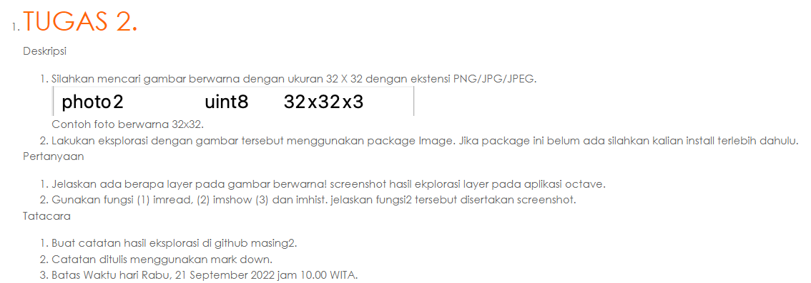
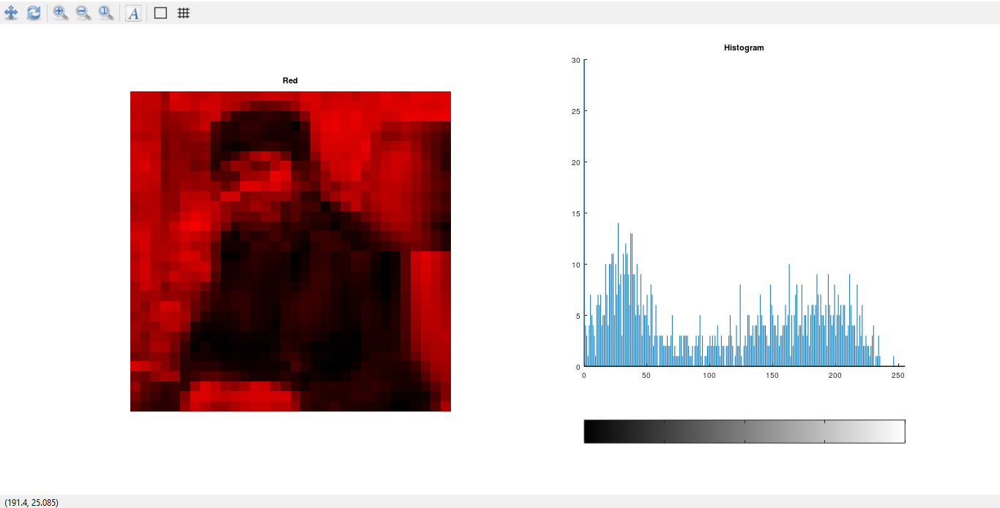
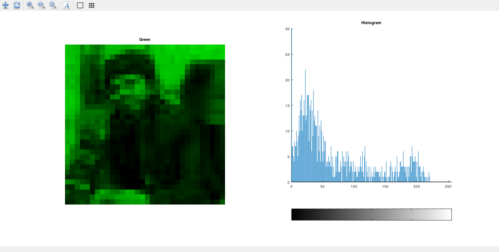
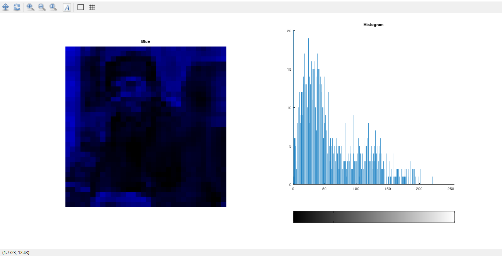
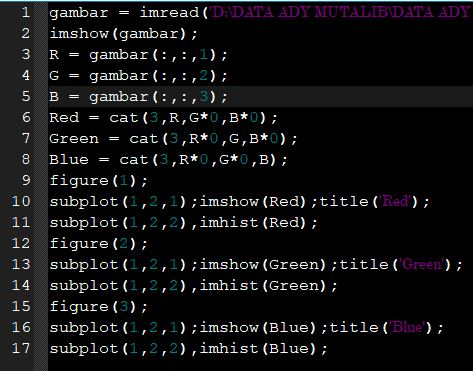

<h1 align="center">Pemrosesan Citra Digital</h1>
<h1 align="center">Tugas 2</h1>
<h2 align="center">
Nama : Ady Mutalib  
NIM : 2110131110003
</h2>

 

 

---

1. Jelaskan ada berapa layer pada gambar berwarna! screenshot hasil ekplorasi layer pada aplikasi octave. 

**Jawaban :**

Gambar berwarna ada tiga Red Green dan Blue, Hasil ekplorasi layer pada octave :

  

Red

Gambar 1

  

Green

Gambar 2

  

Blue

Gambar 3

  

2. Jelaskan ada berapa layer pada gambar berwarna! screenshot hasil ekplorasi layer pada aplikasi octave. 

**Jawaban :**

Gunakan fungsi (1) imread, (2) imshow (3) dan imhist. jelaskan fungsi-fungsi tersebut disertakan screenshot :

    gambar = imread(img\photo.jpg)
    imshow(gambar);
    R = gambar(:,:,1);
    G = gambar(:,:,2);
    B = gambar(:,:,3);
    Red = cat(3,R,G*0,B*0);
    Green = cat(3,R*0,G,B*0);
    Blue = cat(3,R*0,G*0,B);
    figure(1);
    subplot(1,2,1);imshow(Red);title('Red');
    subplot(1,2,2),imhist(Red);
    figure(2);
    subplot(1,2,1);imshow(Green);title('Green');
    subplot(1,2,2),imhist(Green);
    figure(3);
    subplot(1,2,1);imshow(Blue);title('Blue');
    subplot(1,2,2),imhist(Blue);

  

Screenshot syntax coding

Gambar 4

  

Penjelasan fungsi : 

- Imread 
    - Berfungsi untuk membaca file image ituberada

- Imshow 
    - Berfungsi untuk menampilkan objek gambar

- Imhist 
    - Berfungsi untuk menampilkan image dengan bentuk histogram

