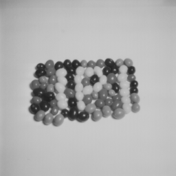
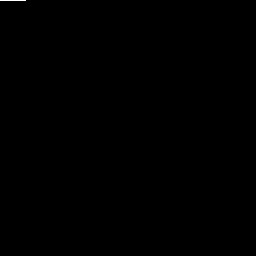

### Nama : Ady Mutalib
### Nim : 2110131110003

### Dosen Pengampu :
- Dr. Harja Santanapurba, M.Kom.
- Novan Alkaf B. S. S.Kom., M.T.

Tugas : Memasukkan nama dan nim kedalam LSB Gambar atau lapisan layar yang paling tidak menyerupai

dibawah ini merupakan source code untuk memasukkan nama dan nim kedalam layer gambar yang paling tidak menyerupai atau LSB

untuk memasukkan pesan rahasia kedalam gambar sebelumnya kita harus menyiapkan sebuah gambar terlebih dahulu, dan untuk memudahkan lagi kita grayscalekan terlebih dahulu gambarnya

selanjutnya buatlah pesan yang ingin dimasukkan, dan ubah pesan sebelumnya menjadi biner terlebih dahulu menggunakan `dec2bin(pesan, bit-level yang dimau)` karena hasilnya nanti menjadi string sebaiknya kita ganti tipenya menjadi numerik kembali menggunakan `str2num` selanjutnya kita transpose pesan yang sudah menjadi biner kenapa? karena saat pesan baru dirubah menjadi biner maka susunannya menjadi terbalik.

terakhir tinggal kita masukkan pesan kedalam layer gambar yang paling tidak menyerupai.

``` java
    img = imread('4.1.07.tiff');
    img_gray = rgb2gray(img);
    [row,col] = size(img_gray);

    pesan = "Ady Mutalib 2110131110003";

    ascii_pesan = uint8(pesan);

    biner_pesan = dec2bin(ascii_pesan,8);
    biner_pesan = str2num(biner_pesan);

    t_pesan = transpose(biner_pesan);

    tPesanA = t_pesan(:);

    tHasil_pesan = transpose(tPesanA);

    panjang = length(tHasil_pesan);

    counter = 1;

    stego_img = img_gray;
    %stego_img = zeros(row,col);

    for x = 1:row
    for y = 1:col
        if (counter <= panjang)
        LSB = bitget(img_gray(x,y),1);
        biner_pS = tHasil_pesan(counter);
        temp = xor(LSB, biner_pS);
        stego_img(x,y) = img_gray(x,y) + temp;

        counter = counter + 1;
        else
        break;
        endif
    endfor
    endfor

    imwrite(stego_img, "stego1.png");

```

dapat kita lihat pada gambar dibawah ini adalah foto yang sudah berisikan pesan rahasia, tidak ada perubahan karena kita memasukkan pesan atau nama dan nim hanya pada LSB layer gambar yang paling tidak menyerupai



dan pada gambar dibawah ini dapat kita lihat pada sudut kiri ada perubahan warna, sebenarnya yang berubah warna itulah yang merupakan pesan rahasianya terletak pada sudut atas paling kiri gambar.

