 

<h2 align="center">Image Enhancement</h2>

- Image enhancement = perbaikan kualitas citra
- Tujuan: memperoleh citra yang lebih sesuai digunakan untuk aplikasi lebih lanjut (misal: mengenali objek di dalam citra).
- Merupakan satu proses awal dalam pengolahan citra (preprocessing)
- Mengapa memerlukan image enhancement?
    - citra mengandung derau (noise)
    - citra terlalu terang/gelap, citra kurang tajam, kabur (blur)
    - cacat saat akuisisi citra: 
- lensa: object blurring atau background blurring
- objek bergerak kamera bergerak: motion blurring
    - Distorsi geometrik disebabkan oleh lensa atau sudut pengambilan

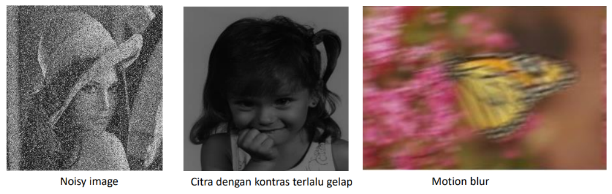

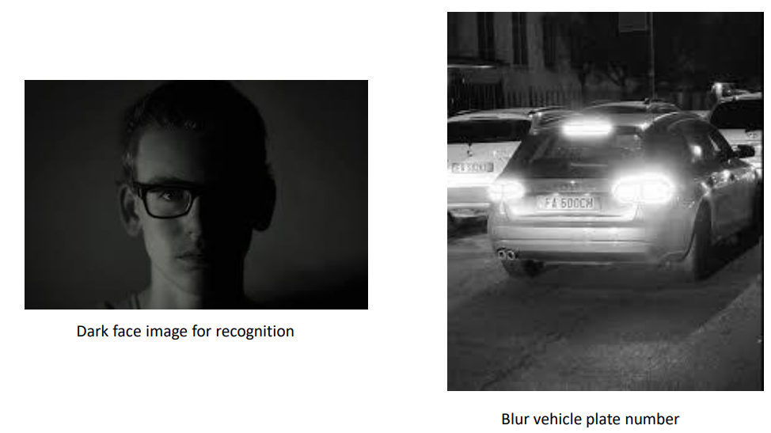
 

- Berdasarkan ranah (domain) operasinya, metode-metode untuk perbaikan
kualitas citra dapat dikelompokkan menjadi dua kategori:
    1. Image enhancement dalam ranah spasial
    2. Image enhancement dalam ranah frekuensi

- Metode-metode image enhancement dalam ranah spasial dilakukan
dengan memanipulasi secara langsung pixel-pixel di dalam citra.
- Metode-metode image enhancement dalam ranah frekuensi
dilakukan dengan mengubah citra terlebih dahulu dari ranah spasial
ke ranah frekuensi, baru kemudian memanipulasi nilai-nilai frekuens
tersebut.
- Masing-masing ranah operasi digunakan untuk tujuan spesifik, karena
tidak semua perbaikan citra dapat dilakukan dalam ranah spasial.
- Materi di dalam PPT ini membahas metode-metode image 
enhancement dalam ranah spasial terlebih dahulu

## Metode dalam Ranah Spasial
- Misalkan: 
    - f(x,y) : citra input
    - g(x,y) : citra output
    - T adalah operator terhadap f
- Metode pemrosesan citra dalam ranah spasial dinyatakan sebagai: 
    - g(x,y) = T [ f(x,y) ]
- T bisa beroperasi pada satu pixel, sekelompok pixel bertetangga, atau
keseluruhan pixel di dalam citra. 
- Jadi, metode dalam ranah spasial dapat dilakukan pada aras titik (pixel), aras
lokal, dan aras global.

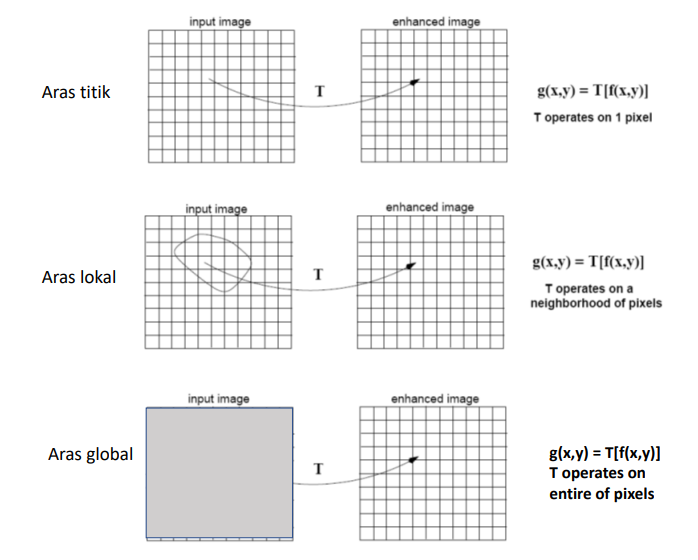

Proses-proses yang termasuk ke dalam perbaikan kualitas citra:
- Pengubahan kecerahan gambar (image brightening)
- Citra negatif (image negatives)
- Peregangan kontras (contrast stretching)
- Pengubahan histogram citra.
- Pelembutan citra (image smoothing)
- Penajaman (sharpening) tepi (edge).
- Pewarnaan semu (pseudocolouring)
- Pengubahan geometrik
- dll

## Pemrosesan dalam aras titik
- g(x,y) = T [ f(x,y) ]
- T hanya beroperasi pada pixel tunggal
- T adalah fungsi transformasi nilai grayscale, 
sehingga ditulis:
    - s = T(r)
    - r : variabel yang menyatakan nilai grayscale f(x,y) 
    - s : variabel yang menyatakan nilai grayscale g(x,y)

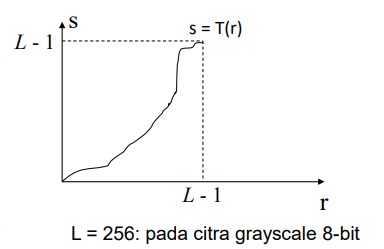

Contoh-contoh image enhancement dalam aras titik:
1. Mencerahkan citra (image brightening)
2. Menegatifkan citra (image negatives)
3. Peregangan kontras (contrast stretching)
4. Gamma correction
5. dll

## Pencerahan citra (image brightening)
- Kecerahan citra dapat diperbaiki dengan menambahkan/mengurangkan
sebuah konstanta kepada (atau dari) setiap pixel, atau mengalikan
sebuah konstansta ke setiap pixel.

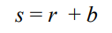

- Jika b positif, kecerahan citra bertambah, 
Jika b negatif kecerahan citra berkurang

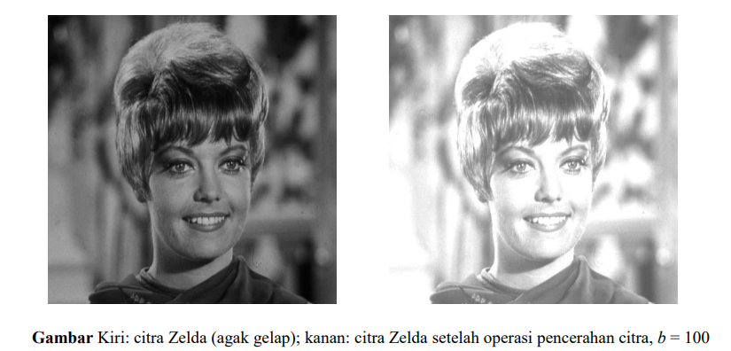

- Perlu operasi clipping jika nilai r + b berada di bawah nilai intensitas
minimum atau di atas nilai intensitas maksimum:
    - jika r + b > 255, maka s = 255
    - jika r + b < 0, maka s = 0

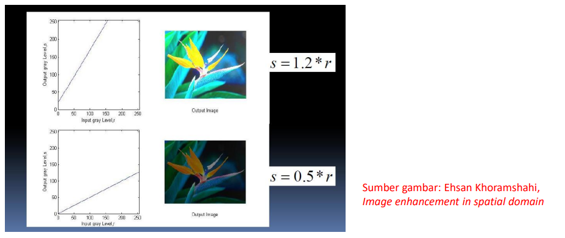

- Operasi pencerahan yang lain adalah menggunakan rumus:

    s = ar + b

    a dan b adalah konstanta

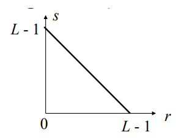

## Menegatifkan Citra (Image Negatives)

Seperti film negatif pada fotografi.
- Misalkan citra memiliki L derajat keabuan
- Caranya: kurangi nilai intensitas
pixel dari nilai keabuan maksimum (L – 1)

    s = (L – 1) – r 

Contoh pada citra grayscale 8-bit:

    s = 255 – r

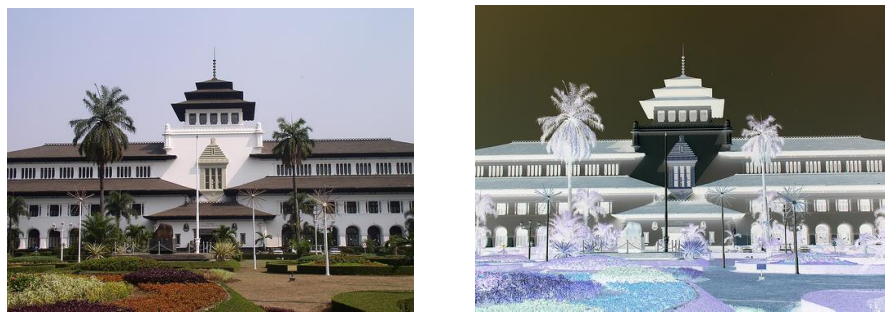

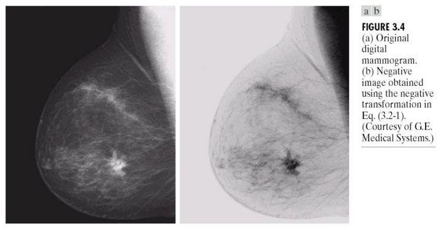

- Sebagai proses image enhancement, menegatifkan citra bermanfaat
bila area hitam sangat dominan di dalam citra, misalnya foto sinar-X 
dan citra mammografi.
    
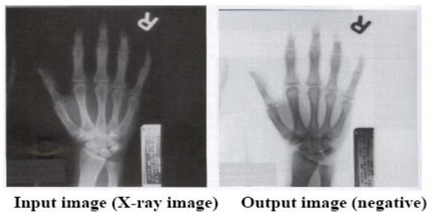
    
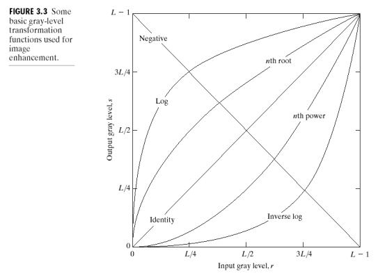

- Menegatifkan citra adalah salah satu transformasi linier. Selain
transformasi linier, terdapat tiga fungsi transformasi dasar keabuan:

- Fungsi linier
    - Transformasi negatif dan transformasi identitas
- Fungsi logaritma
    -Transformasi log dan inverse-log
- Fungsi pangkat
    - Transformasi pangkat n dan transformasi akar pangkat n

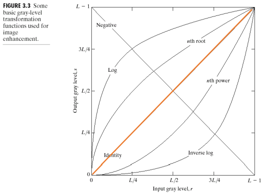

### a) Transformasi identitas
- Nilai keabuan citra output sama dengan keabuan citra input
- Dimasukkan ke dalam grafik hanya untuk melengkapi

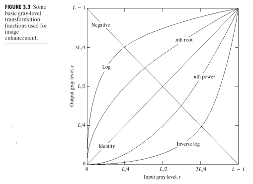

### b) Transformasi Log
- Fungsi s = c log(1+r)
- Transformasi log memiliki sifat: 
    1. Untuk citra yang memiliki rentang yang sempit
untuk nilai-nilai keabuan yang rendah (gelap),
dipetakan menjadi rentang yang lebih luas pada
citra luaran. 
    2. Untuk citra yang memiliki rentang yang lebar untuk
nilai-nilai keabuan yang tinggi (terang), dipetakan
menjadi rentang yang lebih sempit pada citra
luaran
- Pada transformasi log balikan (inverse), yang terjadi
adalah kebalikannya.

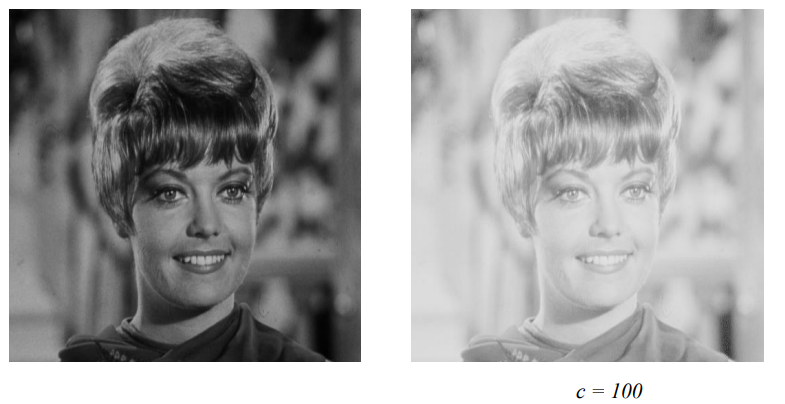

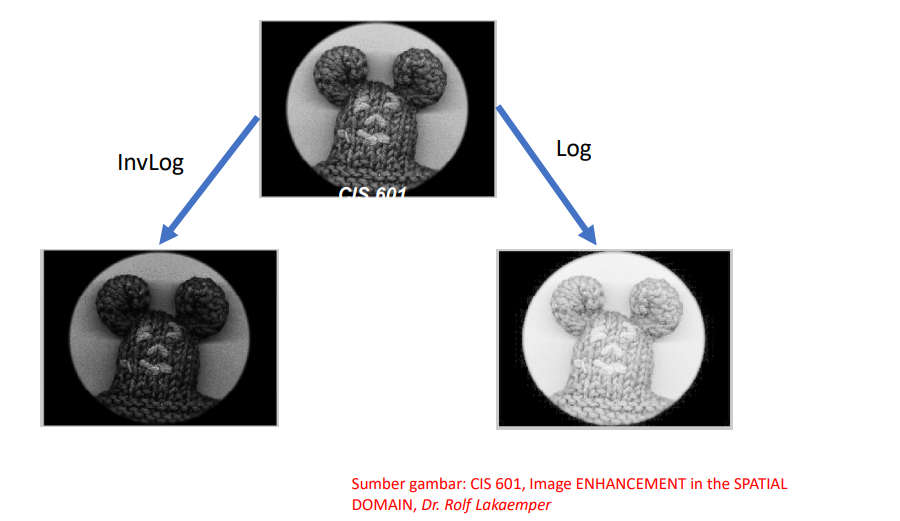

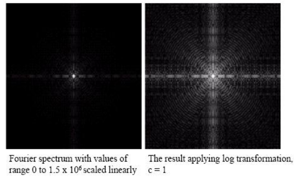

Application: 
- This transformation is suitable for the case when the dynamic range of a processed 
image far exceeds the capability of the display device (e.g. display of the Fourier 
spectrum of an image) 
- Also called “dynamic-range compression / expansion"

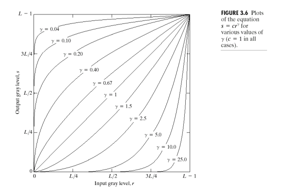

### c) Transformasi Pangkat
- Fungsi pangkat: 

    s = cr y

c dan y adalah konstanta positif. 

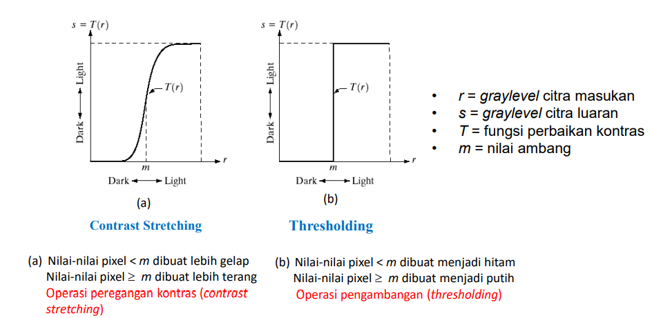

## Perbaikan kontras (contrast enhancement)

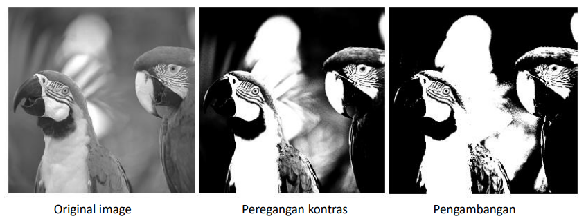

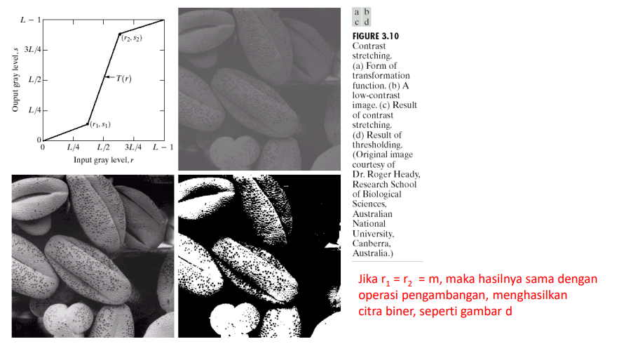

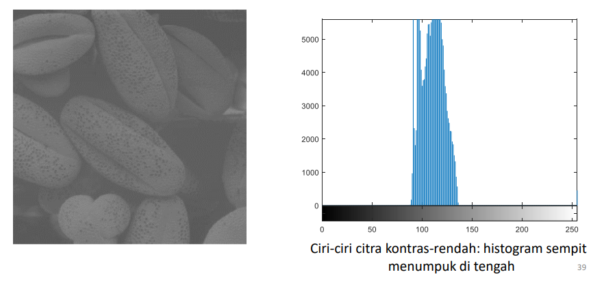

### Peregangan kontras (contrast stretching)
- Peregangan kontras merupakan metode sederhana untuk
memperbaiki citra yang memiliki kontras rendah
    
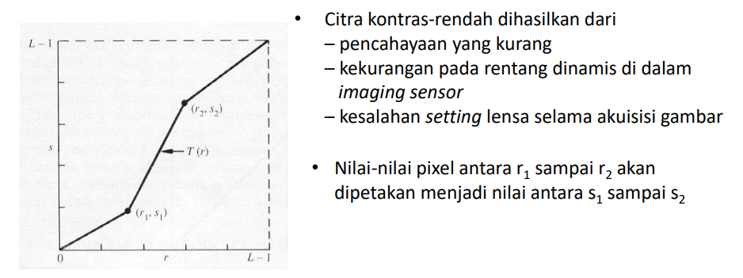

- Tujuan peregangan kontras: meningkatkan rentang nilai-nilai keabuan
untuk citra kontras-rendah (terentang dari nilai r1
sampai r2 pada 
citra dengan nilai keabuan 0 sampai L – 1)
    
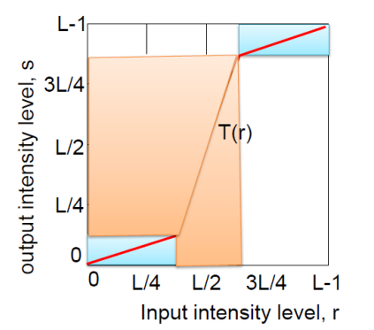

- Selang [r1
, r2
] yang sempit diregang menjadi selang [s1
, s2
] yang lebih lebar
    

- Nilai-nilai di antara (r1
,s1
) and (r2
,s2
) menghasilkan penyebaran nilai keabuan
citra luaran.

- Lokasi (r1
,s1
) dan (r2
,s2
) menentukan
bentuk fungsi transformasi.
    
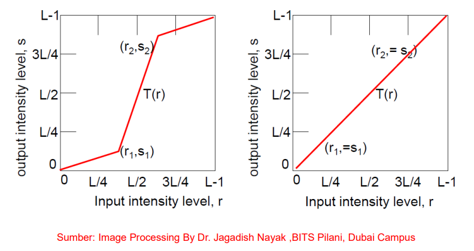
    
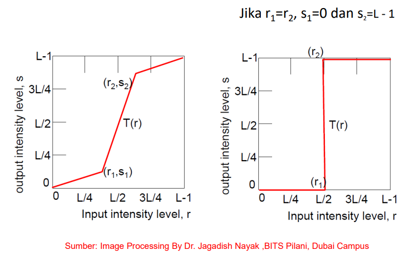
    
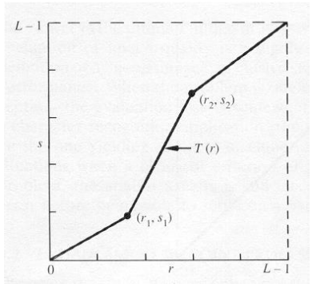

- Bagaimana menentukan r1 dan r2
?
Salah satu pendekatan: 
- pindai histogram citra, atau pindai pixel-pixel di dalam citra
- cari pixel bernilai minimum, misalkan rmin
- cari pixel bernilai maksimum, misalkan rmax
- pixel-pixel di bawah rmin diset 0
- Pixel-pixel di atas rmax diset L – 1 
- r1 = rmin, r2 = rmax
- tentukan persamaan garis yang menghubungkan titik
(rmin, 0) dan (rmax, L - 1) dengan persamaan umum
garis: (y – y1)/(y2 – y1) = (x – x1)/(x2 – x1) 
- petakan nilai keabuan yang lain di antara (rmin, 0) dan 
(rmax, L - 1) dengan dengan menggunakan persamaan tersebut
    
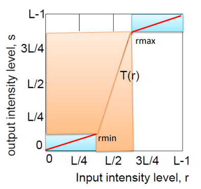

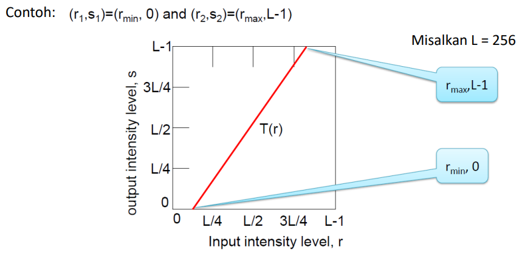

