# Nama : Khairul Fuad
# NIm : 2110131310002

## __High Pass Filtering(HPF)__

__High Pass Filtering(HPF)__ adalah proses filter yang mengambil citra dengan gradiasi intensitas yang tinggi dan perbedaan intensitas yang rendah akan dikurangi atau dibuang. High Pass Filtering adalah salah satu dari metode penajaman (sharpening).

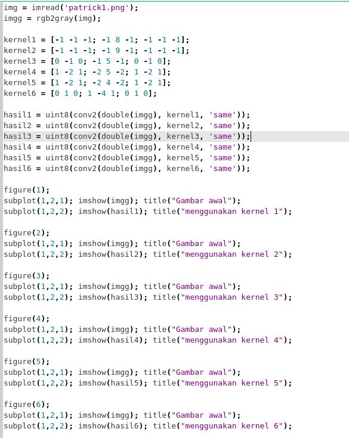

Tujuan utama dari proses penajaman ini adalah untuk menyoroti detail-detail halus dalam gambar atau untuk meningkatkan detail yang telah dikaburkan baik dalam kesalahan atau efek alami dari proses akuisisi citra tertentu.

### __Kegunaan HPF__

- High-Pass Filter sering disebut juga sebagai filter penajaman tepi (edge sharpening) karena HPF digunakan dalam proses penajaman citra.

- Operasi penajaman citra bertujuan untuk memperjelas tepi pada objek di dalam citra atau menghilangkan bagian citra yang lembut.

- Karena penajaman citra lebih berpengaruh pada tepi (edge) objek, maka penajaman citra sering disebut juga penajaman tepi (edge sharpening) atau peningkatan kualitas tepi (edge enhancement).

### __Hasil HPF__

- kernel 1

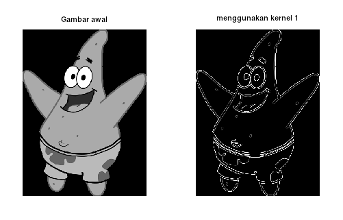

- kernel 2

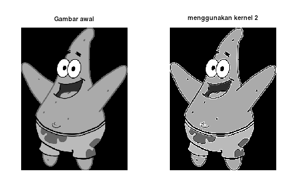

- kernel 3

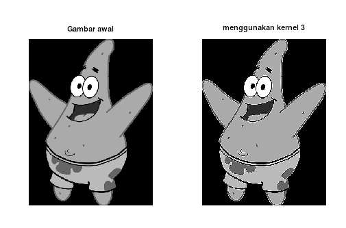

- kernel 4

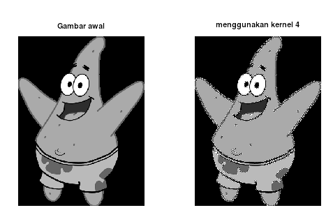

- kernel 5

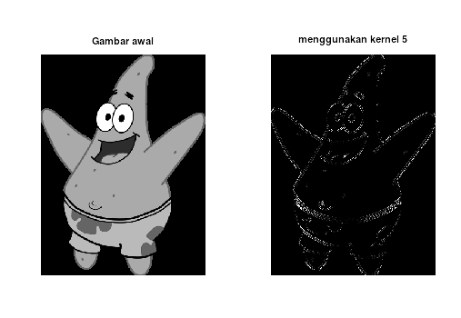

- kernel 6

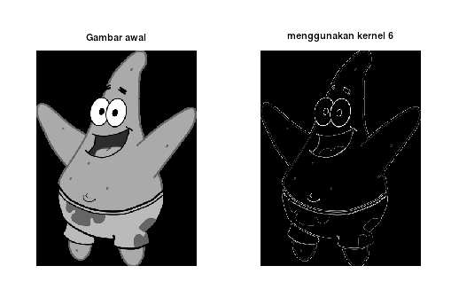

## __Low Pass Filtering(LPF)__

__Low Pass FIltering(LPF)__ adalah Proses filter yang melewatkan komponen citra dengan nilai intensitas yang rendah dan meredam komponen citra dengan nilai intensitas yang tinggi. Low Pass Filter disebut juga smoothing filter yang merupakan salah satu metode untuk menghilangkan noise acak, noise berkala, dan menampilkan pola latar belakang.

Low pass filtering digunakan untuk membuat citra menjadi lebih halus dan lebih blur. Efek pengaburan ini disebut dengan efek blurring.

### __Ciri LPF__

- Jumlah semua elemen kernel bernilai satu.

- Elemen kernel tidak ada yang bernilai negatif

- Tinggi dan lebar kernel ganjil, jika tidak bernilai ganjil maka piksel pusat tidak bisa ditemukan.

- Bobot dalam kernel bersifat simetris terhadap piksel pusat

### __Hasil LPF__

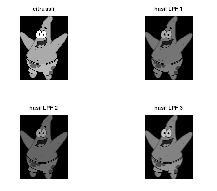

## __Median Filtering__

Median Filtering adalah salah satu teknik filter yang mengurutkan nilai intensitas sekelompok pixel, kemudian mengganti nilai pixel yang diproses dengan nilai mediannya (nilai tengahnya). , metode ini digunakan dalam penghalusan citra (image smoothing) atau menghilangkan derau noise. Filter ini merupakan suatu filter non linear yang dikembangkan oleh Tukey.

- Manual

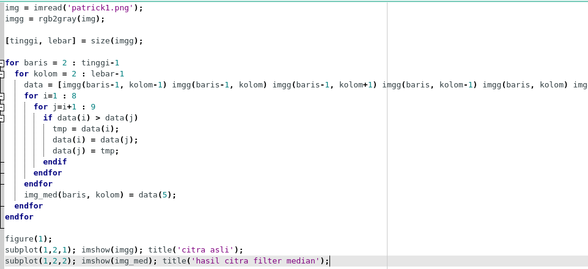

- menggunakan fungsi

### __Hasil Median Filtering__

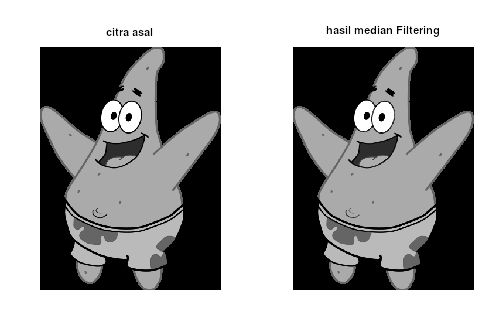

## __High Boost Filtering__

High-Boost merupakan salah satu bagian dari operasi yang dapat dilakukan untuk melakukan perbaikan citra. High-Boost Filtering bertujuan untuk mempertahankan (mempertajam) komponen frekuensi tinggi yang menunjukan detail dari sebuah citra dan menghilangkan (mengurangi) komponen frekuensi rendah

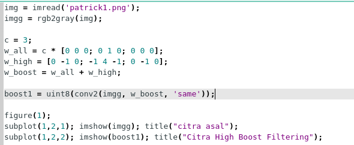

### __HBF Hasil__

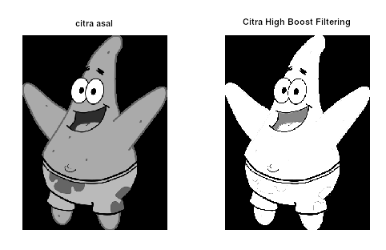
