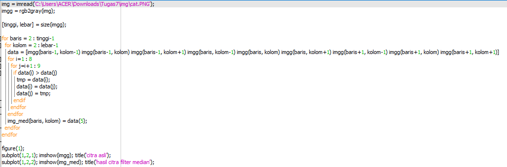
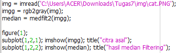
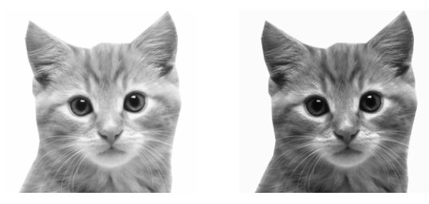

# ===== Pemprosesan Citra Digitan =======
# Tugas Kelompok 
# Anggota :
# 1. Ady Mutalib
# 2. Alfika Nurfadia
# 3. Adelia Erlyn
# 4. Ahmad Firdaus

---
# LOW PASS FILTERING
## 1. Pengertian
Low-pass filtering adalah proses filter yang melewatkan komponen citra dengan nilai intensitas yang rendah dan meredam komponen citra dengan nilai intensitas yang tinggi.

LPF (Low Pass Filter) atau disebut juga smoothing filter merupakan salah satu metode untuk menghilangkan noise acak, noise berkala, dan menampilkan pola latar belakang. 
Fungsi dasar dari low-pass filter yang ideal adalah untuk memperkirakan rata-rata sebuah piksel dan semua piksel tetangga dan akhirnya mengganti nilai asli dari piksel tersebut. 

Low pass filter diterapkan untuk menghasilkan citra yang lebih halus dan lebih blur. 

Aturan kernel untuk low-pass filter adalah:
1. Semua koefisien kernel harus positif
2. Jumlah semua koefisien kernel harus sama dengan 1.

Contoh kernel yang dapat digunakan pada low-pass filtering adalah

- Contoh Code Menggunakan OCTAVE

## __Median Filtering__

Median Filtering adalah salah satu teknik filter yang mengurutkan nilai intensitas sekelompok pixel, kemudian mengganti nilai pixel yang diproses dengan nilai mediannya (nilai tengahnya). , metode ini digunakan dalam penghalusan citra (image smoothing) atau menghilangkan derau noise. Filter ini merupakan suatu filter non linear yang dikembangkan oleh Tukey.

- Manual

- menggunakan fungsi

### __Hasil Median Filtering__

## __High Boost Filtering__

High-Boost merupakan salah satu bagian dari operasi yang dapat dilakukan untuk melakukan perbaikan citra. High-Boost Filtering bertujuan untuk mempertahankan (mempertajam) komponen frekuensi tinggi yang menunjukan detail dari sebuah citra dan menghilangkan (mengurangi) komponen frekuensi rendah

### __HBF Hasil__

