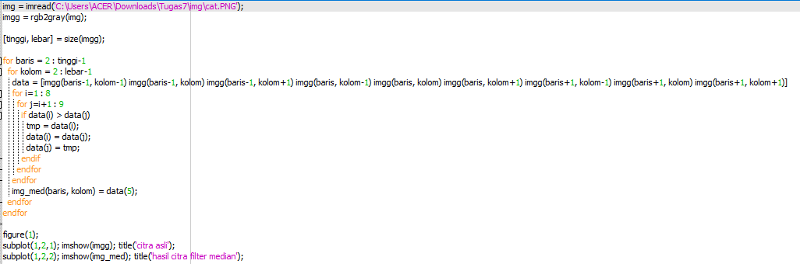
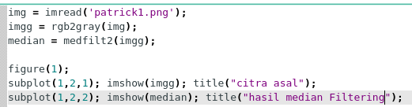
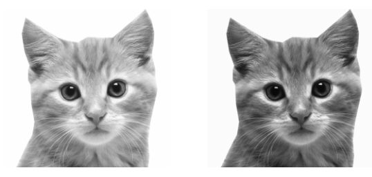
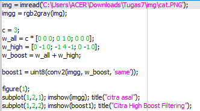
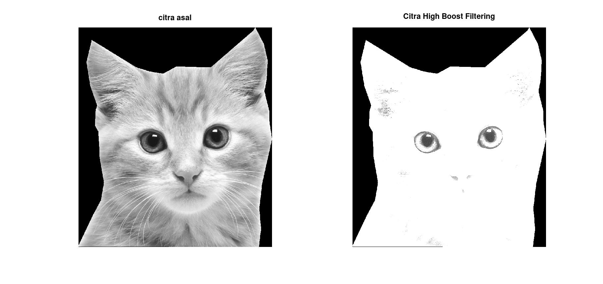

# ===== Pemprosesan Citra Digitan =======
# Tugas Kelompok 
# Anggota :
# 1. Ady Mutalib
# 2. Alfika Nurpadia
# 3. Adelia Erlyn
# 4. Ahmad Firdaus

## __Median Filtering__

Median Filtering adalah salah satu teknik filter yang mengurutkan nilai intensitas sekelompok pixel, kemudian mengganti nilai pixel yang diproses dengan nilai mediannya (nilai tengahnya). , metode ini digunakan dalam penghalusan citra (image smoothing) atau menghilangkan derau noise. Filter ini merupakan suatu filter non linear yang dikembangkan oleh Tukey.

- Manual

- menggunakan fungsi

### __Hasil Median Filtering__

## __High Boost Filtering__

High-Boost merupakan salah satu bagian dari operasi yang dapat dilakukan untuk melakukan perbaikan citra. High-Boost Filtering bertujuan untuk mempertahankan (mempertajam) komponen frekuensi tinggi yang menunjukan detail dari sebuah citra dan menghilangkan (mengurangi) komponen frekuensi rendah

### __HBF Hasil__

